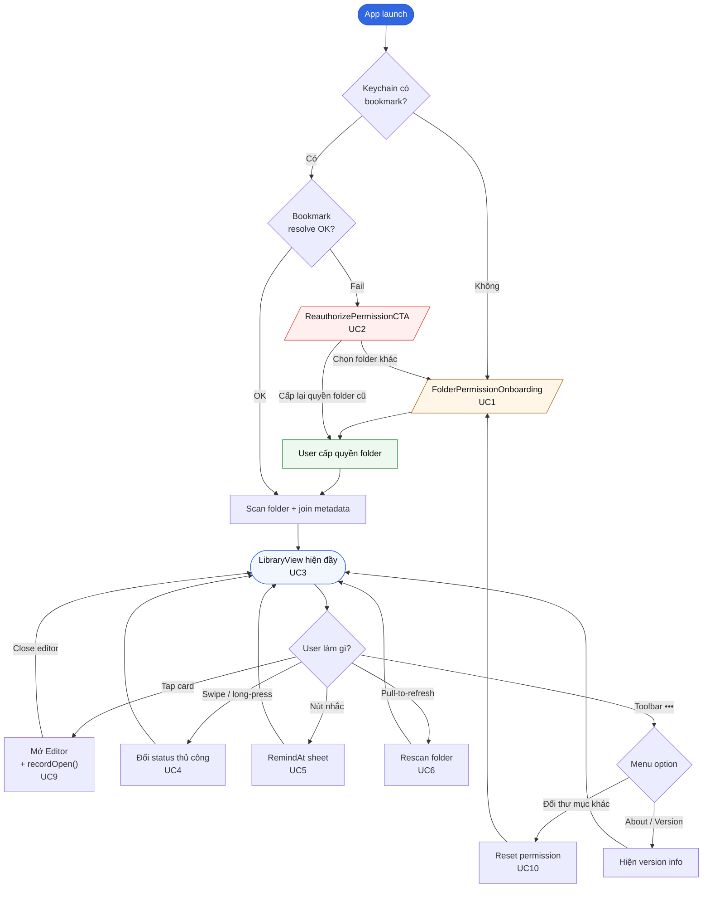
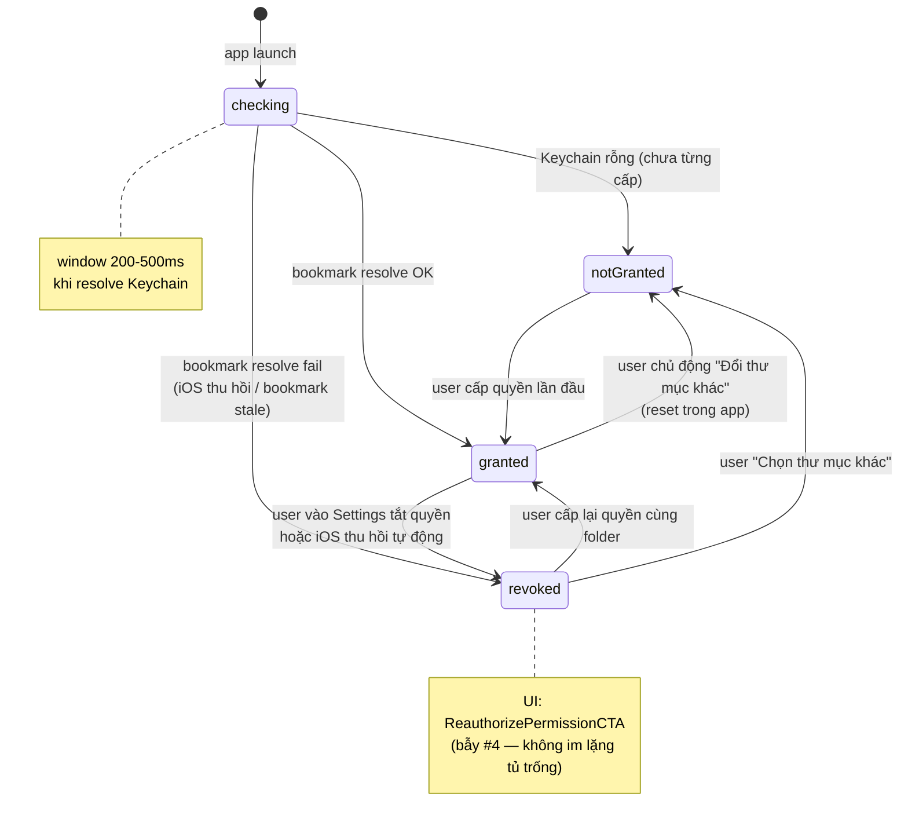
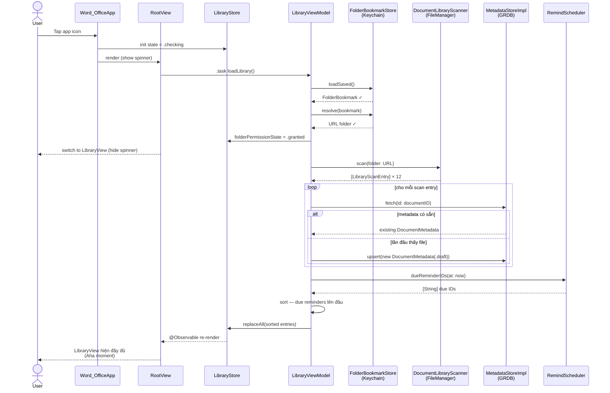
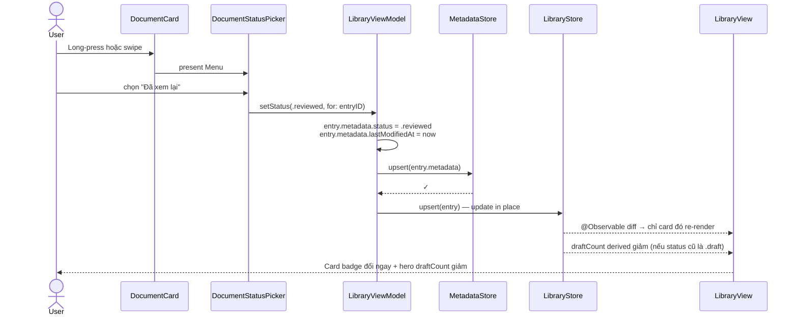

# Tủ hồ sơ — Flow & Use Case Review

> **Mục đích file**: tổng hợp toàn bộ use case của Tủ hồ sơ để user duyệt xem có gì thiếu / sai logic trước khi code A7 View layer.
> **Không lặp lại** `Library-Architecture.md` (chi tiết kỹ thuật) và `Phase0-Implementation-Logic-v2.md` §10 (spec gốc).
> **Cập nhật**: 2026-08-28

---

## 1. Journey timeline — kể chuyện user

Đọc từ trái sang phải, đây là **cả cuộc đời của user với app** — từ lần cài đầu đến habit loop hàng ngày.

```mermaid
flowchart LR
    A([Cài app]) --> B([Mở lần đầu])
    B --> C[/"Onboarding<br/>'Chọn thư mục'"/]
    C --> D[Tap picker]
    D --> E[/"Chọn iCloud Drive /<br/>Documents / Work"/]
    E --> F([Tủ tự đầy 12 file<br/>Aha moment #1])
    F --> G[User đổi status<br/>hoặc đặt nhắc<br/>hoặc mở file]
    G --> H([Đóng app])
    H --> I([Mở lại sau vài giờ])
    I --> J([Tủ đầy sẵn ngay<br/>Aha moment #2 — habit])
    J --> G

    style F fill:#3267E3,stroke:#2858C9,color:#fff
    style J fill:#218739,stroke:#1B6E2E,color:#fff
    style C fill:#F2F6FF,stroke:#3267E3,color:#0E1013
    style E fill:#F2F6FF,stroke:#3267E3,color:#0E1013
```

**Điểm mấu chốt:**
- **Aha moment #1** (F) = tủ tự đầy sau khi cấp quyền — chứng minh "app hiểu tài liệu của tôi"
- **Aha moment #2** (J) = mở app lần sau, tủ đã đầy sẵn — chứng minh "app tiết kiệm thời gian" → habit loop bắt đầu
- Từ J trở đi, user vào chu trình G↔J lặp lại (Zeigarnik effect)

---

## 2. High-level flowchart — mọi đường đi trong app

Tổng thể tất cả nhánh có thể xảy ra. Đánh dấu UC tương ứng để tra chi tiết ở §4.

**Node quan trọng:**
- **`Show`** (LibraryView đầy) = trạng thái ổn định, mọi action đều return về đây
- **`Actions`** = decision point chính — 5 lựa chọn user có (chưa kể pinch-to-zoom, sẽ có ở Editor)
- **`Overflow`** = mọi thao tác ít dùng (đổi folder, about) — đặt trong menu `•••` để không lộn với action chính

**Path chưa vẽ (nằm ngoài LibraryView):**
- File Provider extension (Sprint 0.3) — user thao tác trong Files.app
- Editor toolbar (Sprint 0.4) — export, share, AirPrint
- Settings screen (đã có skeleton) — theme, font size

---

## 3. State machine — `folderPermissionState`

---

## 4. Use case ĐÃ CÓ trong spec (5 diễn biến)

Copy từ `Library-Architecture.md` §4. Đầy đủ chi tiết ở file đó.

| # | Use case | Trigger | Kết quả |
|---|---|---|---|
| UC1 | App mở lần đầu (chưa cấp quyền) | Launch + `bookmarkStore.loadSaved() == nil` | Show `FolderPermissionOnboarding` |
| UC2 | Bookmark bị revoke | Launch + `bookmarkStore.resolve()` throw | Show `ReauthorizePermissionCTA` |
| UC3 | Mở app lần sau (đã cấp quyền) | Launch + bookmark resolve OK | Auto-scan folder → hiện tủ đầy |
| UC4 | User đổi status thủ công | Swipe / menu context / tap → chọn status mới | Update `MetadataStore` + refresh `LibraryStore` |
| UC5 | Đặt reminder + hiển thị | User → sheet chọn date → save + về ngày đó mở app | File có `remindAt <= now` sort lên đầu list |

---

## 5. Use case TIỀM ẨN — cần user xác nhận

Các case này KHÔNG có trong spec chi tiết hoặc chỉ mention lướt qua. Cần chốt logic trước khi code.

### ⚠️ UC6 — File mới thêm vào folder từ NGOÀI

**Scenario**: User copy 1 file `.docx` mới vào folder cấp quyền qua Files.app / iCloud web / Mac Finder.

- **Đã rõ**: Mở app lần sau → `loadLibrary()` scan lại → auto pick up ✓
- **⚠️ Chưa rõ**: 
  - Nếu app đang MỞ (không đóng lại), user copy file mới → **không auto-detect**?
  - Cần pull-to-refresh trên `LibraryView` để rescan không?
  - Có nên dùng `NSFileCoordinator` / `NSFilePresenter` để watch folder khi app active?

**Recommend**: Pull-to-refresh (`.refreshable`) là đủ cho MVP. `NSFilePresenter` phức tạp + edge case nhiều. Chấp nhận user active-refresh khi biết vừa thêm file.

### ⚠️ UC7 — File bị XOÁ ngoài folder

**Scenario**: User xoá file trong Files.app / trên Mac.

- **Backend hiện tại**: Scan không thấy file → không insert vào `entries` → **metadata trong SQLite mồ côi**
- **⚠️ Chưa rõ**:
  - Có cleanup orphan metadata không? Hay giữ để nếu user restore file thì trạng thái vẫn còn?
  - SQLite lớn dần theo thời gian nếu user xoá nhiều
  - `draftCount()` query có thể trả về số sai (đếm cả metadata mồ côi có `status = .draft`)

**Recommend**: Sau mỗi `loadLibrary()`, chạy cleanup: delete metadata mà documentID không có trong scan result. **Risk**: nếu user tạm remove file rồi restore → mất status. Compromise: chỉ cleanup nếu file vắng ≥ 30 ngày (thêm field `lastSeenAt`).

**Câu hỏi user**: giữ metadata mồ côi hay cleanup ngay?

### ⚠️ UC8 — Đổi TÊN file ngoài folder

**Scenario**: User rename `hopdong.docx` → `hopdong-final.docx` trong Files.app.

- **DocumentID design (arch v2.2)**:
  - **Primary**: APFS `documentIdentifierKey` — bền vững qua rename → metadata giữ ✓
  - **Fallback**: SHA256 relative path — rename → **path đổi → hash đổi → mất metadata**
- **⚠️ Chưa rõ**:
  - APFS `documentIdentifierKey` có support trên **tất cả** iCloud / Local Files / third-party providers (Google Drive, Dropbox)?
  - Nếu fallback path hash → user không hiểu tại sao trạng thái mất

**Recommend**: Cần verify APFS support trên iCloud + Files provider chính. Nếu không support → escalate: thêm bookmark-per-file approach (spec đã note escalation trigger).

### ⚠️ UC9 — Tap file → mở Editor

**Scenario**: User tap 1 DocumentCard → mở editor.

- **Đã có backend**: `LibraryViewModel.recordOpen(entryID)` → update `lastOpenedAt` ✓
- **⚠️ Chưa rõ**:
  - Sau khi close editor, có prompt "Đổi trạng thái thành 'Đã xem lại'?" không?
  - Hay giữ đúng bẫy #2 (không auto), user tự đổi qua menu?
  - Nếu prompt → prompt CHỖ NÀO? Trong editor toolbar, hay banner khi về LibraryView?

**Recommend theo spec**: Không prompt tự động. Nhưng có thể thêm subtle affordance — sau khi close editor, hiện toast nhẹ "Đổi trạng thái?" 3 giây rồi biến mất. User bỏ qua = OK, tap = mở menu picker.

### ⚠️ UC10 — User đổi THƯ MỤC cấp quyền

**Scenario**: User vào toolbar overflow menu → "Đổi thư mục khác" (đã có trong `FolderPermissionViewModel.resetPermission()`).

- **Backend**: `bookmarkStore.delete()` + `store.folderPermissionState = .notGranted` + `store.clear()` ✓
- **⚠️ Chưa rõ**:
  - `metadataStore` có clear luôn không? Hay giữ để user quay về folder cũ vẫn có trạng thái?
  - Nếu folder mới có file trùng documentID với folder cũ → dùng lại metadata cũ hay tạo mới?

**Recommend**: Clear metadata luôn khi reset — đơn giản, không edge case. User đổi folder = fresh start.

### ⚠️ UC11 — iCloud placeholder FAIL download

**Scenario**: File iCloud không tải được (mất mạng, iCloud quota đầy, user cancel).

- **Đã có**: `iCloudDownloadState.failed(reason)` trong scan entry
- **⚠️ Chưa rõ**:
  - UI hiện lỗi cụ thể trên card thế nào? (badge đỏ + tap = retry?)
  - Có retry tự động không?
  - Timeout bao lâu mới đánh `failed`?

**Recommend**: Card hiện icon `exclamationmark.icloud` màu warning + tap card → alert "Tải lại?" — không retry tự động (tránh spam network khi user offline).

### ⚠️ UC12 — Reset metadata 1 file riêng lẻ

**Scenario**: User muốn "xoá trạng thái" 1 file cụ thể (không phải toàn bộ).

- **⚠️ Chưa có trong spec**
- **Câu hỏi**: có UI riêng "Reset file này" trong menu không?
- Hay chỉ cần đổi status về `.draft` là đủ (không cần feature riêng)?

**Recommend**: **KHÔNG cần** cho MVP. Đổi status về `.draft` = tương đương reset. Bỏ reminder = tap "Bỏ nhắc" trong sheet.

### ⚠️ UC13 — App KILL rồi launch lại

**Scenario**: User swipe app đóng khỏi task switcher, mở lại sau 5 phút.

- **Đã rõ**: `folderPermissionState` back to `.checking` → resolve Keychain → về `.granted` → auto-scan
- **⚠️ Chưa rõ**:
  - Cần restore scroll position của LibraryView không? (SwiftUI thường không)
  - Có flash spinner `.checking` state 200-500ms không?
  - Cần cache last `entries` để hiện instant rồi refresh underneath?

**Recommend MVP**: Không cache, không restore scroll. Chấp nhận flash spinner ngắn — đơn giản, đúng spec.

### ⚠️ UC14 — Multiple folders cấp quyền

**Scenario**: User muốn quản lý 2 folder (work + personal) trong cùng app.

- **Spec chốt**: MVP chỉ **1 folder** — quyết định đã có
- **⚠️ Câu hỏi user**: confirm giữ 1 folder cho MVP? Phase 1 mới mở multi-folder?

**Recommend**: Confirm 1 folder cho MVP. Multi-folder = complexity lớn (UI folder picker, per-folder metadata, cross-folder search).

### ✅ UC16 — First-scan familiarity (chốt 2026-08-28)

**Scenario**: User cấp quyền folder lần đầu → app scan 12 file → hiện lên tủ hồ sơ.

- **Vấn đề**: Tất cả file default `.draft` → hero "12 bản nháp còn dở" đọc như 12 việc chưa làm, gây áp lực. Flat list, không phân biệt file mới/cũ, không có tín hiệu "thân thuộc".
- **Chốt Idea 1 + 2** (2026-08-28):

**Idea 1 — Sort + group by date bucket:**
- Sort default: `document.modifiedAt` descending
- 5 bucket: **Hôm nay** · **Hôm qua** · **Trong tuần** · **Trong tháng** · **Cũ hơn**
- User đọc từ trên xuống thấy timeline **của mình** — file làm gần đây trên top, file cũ xuống dưới
- Không cần data mới — chỉ dùng `modifiedAt` có sẵn

**Idea 2 — Hero copy adaptive:**
- `draftCount == totalCount` (first-run) → **"12 tài liệu đang theo dõi"** (welcoming, chào đón)
- `draftCount < totalCount` (đã dùng) → **"3 bản nháp còn dở"** (Zeigarnik signal)
- `draftCount == 0` → **"Tất cả đã xong"** (celebration)
- Cùng hero component, khác copy theo state

**Backend impact:**
- `LibraryViewModel` thêm method `groupByDateBucket(_ entries: [LibraryEntry], now: Date) -> [(DateBucket, [LibraryEntry])]`
- `DateBucket` enum: `.today | .yesterday | .thisWeek | .thisMonth | .older`
- `LibraryView` render sections theo bucket thay flat list
- Hero copy tính theo `draftCount` vs `entries.count`

**Impact với due reminders:**
- Section "Cần xử lý hôm nay" giữ nếu có due — luôn hiện trên top, trước các date bucket
- Nếu 0 due → skip section, xuống thẳng date bucket

**Recommend**: Đã chốt Idea 1+2 vào MVP. Idea 3 (coach mark tooltip) defer nếu có thời gian.

---

### ⚠️ UC15 — Migrate device: iPhone → iPad

**Scenario**: User dùng app trên iPhone 3 tháng, mua iPad Air, cài app.

- **Đã chốt (storage strategy 27/08)**: **Local only** — không sync iCloud metadata
- **Hậu quả**: iPad = fresh install → không có metadata cũ, phải cấp quyền lại folder, tất cả file = `.draft` mới
- **⚠️ Câu hỏi user**: đây có phải deal-breaker cho user "chuyên nghiệp 35-44" (persona chính) không?

**Recommend**: Chấp nhận cho MVP. Sau TestFlight nếu user phản hồi → cân nhắc CloudKit sync (§9 rủi ro arch v2.2).

---

## 6. Sequence — UC3 chi tiết (mở app lần sau, đã cấp quyền)

Đây là flow phức tạp nhất — user thấy Aha moment tủ tự đầy.

---

## 7. Sequence — UC4 (đổi status thủ công)

Ngắn nhưng quan trọng — verify không auto-inference.

---

## 8. Câu hỏi review — chốt trước khi code A7

Tôi cần bạn duyệt các câu hỏi này:

| # | Câu hỏi | Recommendation |
|---|---|---|
| Q1 (UC6) | Cần watch folder khi app đang active không? | Không — pull-to-refresh đủ |
| Q2 (UC7) | Cleanup orphan metadata thế nào? | Delete sau 30 ngày vắng (thêm field `lastSeenAt`) |
| Q3 (UC8) | Verify APFS documentIdentifierKey trên iCloud/third-party providers | Cần spike test trước khi code Editor mở file |
| Q4 (UC9) | Sau close editor, có prompt đổi status không? | Không cho MVP — user tự đổi (đúng bẫy #2) |
| Q5 (UC10) | Đổi thư mục → clear metadata cũ? | Clear luôn, fresh start |
| Q6 (UC11) | iCloud fail → retry logic? | Không auto, user tap card → alert retry |
| Q7 (UC12) | Feature "Reset file này" riêng? | KHÔNG cần |
| Q8 (UC13) | Cache last entries để hiện instant lúc launch? | Không cho MVP |
| Q9 (UC14) | Confirm 1 folder cho MVP? | Confirm — Phase 1 mới multi-folder |
| Q10 (UC15) | Chấp nhận không sync iPhone↔iPad? | Đã chốt 27/08, giữ nguyên |

---

## 9. Cross-reference

- Kiến trúc code (layer, protocol, model): `Library-Architecture.md`
- Spec sản phẩm chi tiết: `Phase0-Implementation-Logic-v2.md` §10 + §4.1
- Task list Sprint 0.2: `GUIDELINE.md`
- Rủi ro tổng: `PHASE_1_ARCHITECTURE.md` v2.2 §9

---

*File này giữ scope hẹp — chỉ review use case. Sau khi bạn duyệt câu hỏi Q1–Q10, các quyết định sẽ merge lại vào Library-Architecture.md + Phase0-Implementation-Logic-v2.md §10 để code A7 khớp đúng.*
